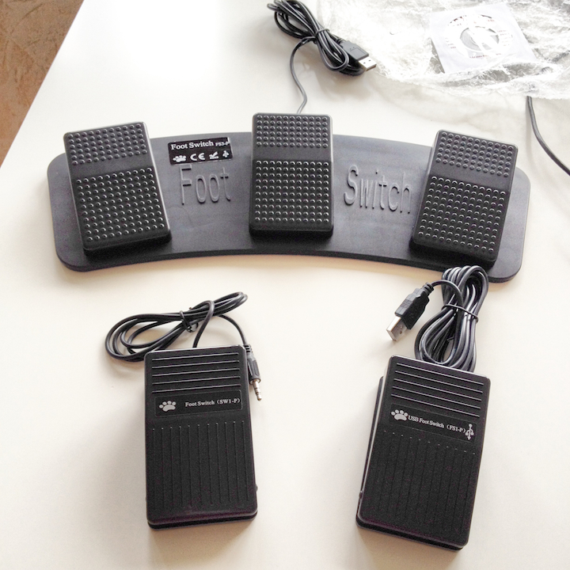
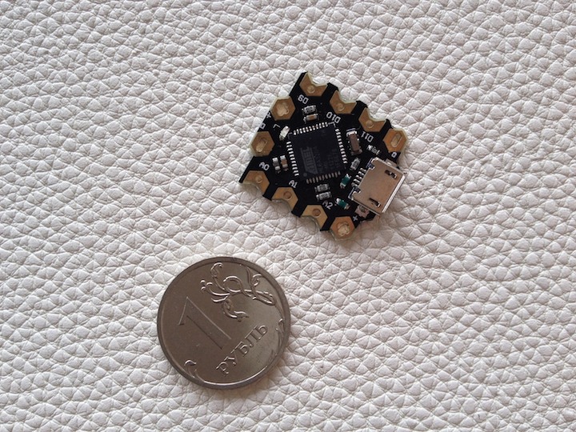
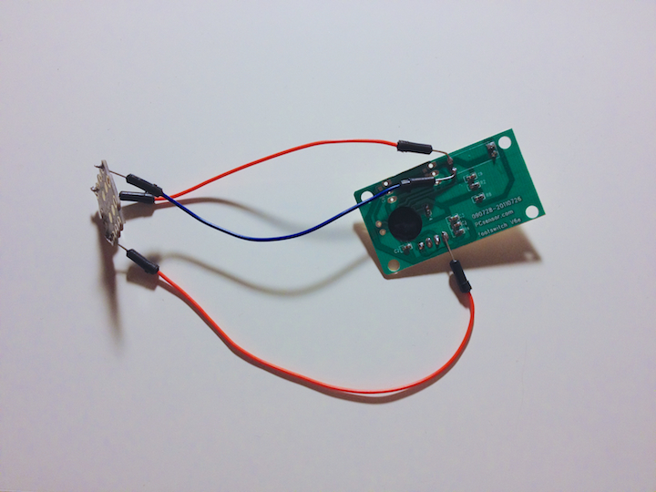
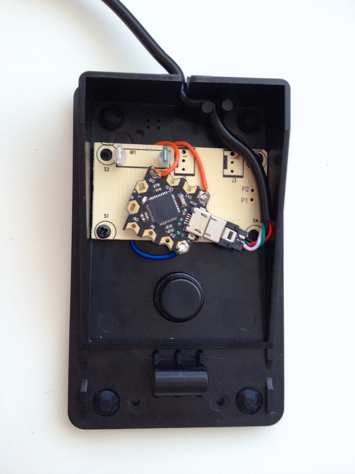
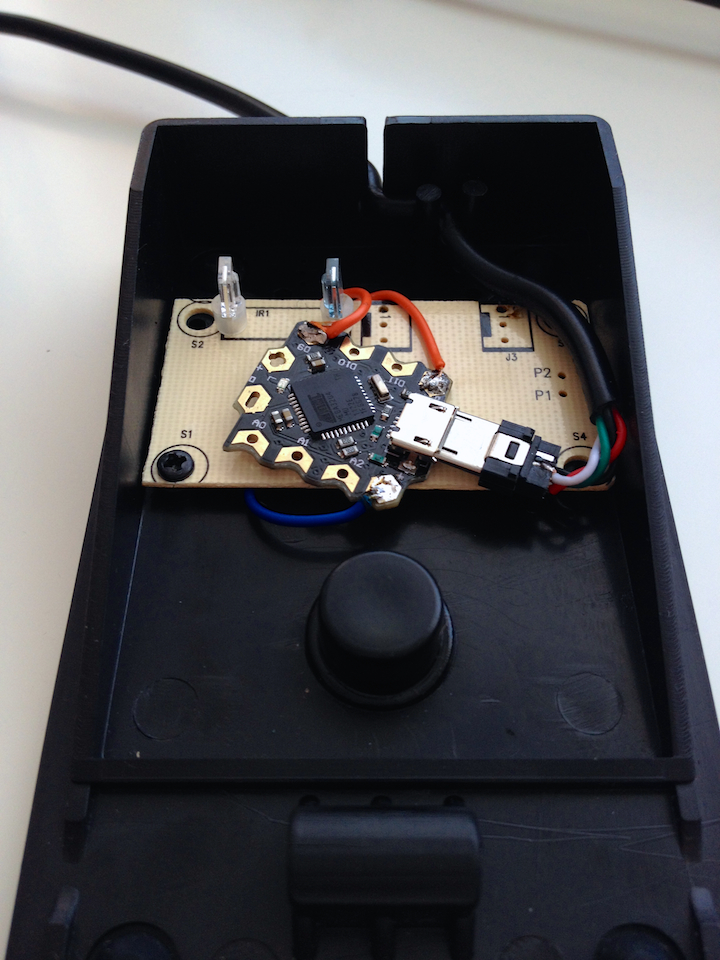
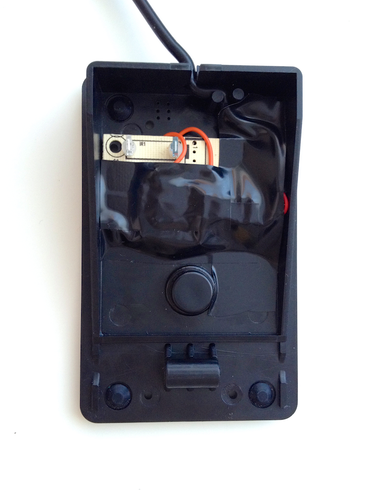
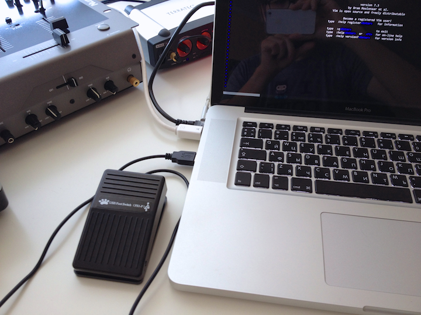

# Vim pedal by Aleksey Kurepin

## Introduction

Vim pedal is a USB HID device for more comfortable text editing for Vim users.
When the pedal is pressed down, the pedal sends `i` [1] causing Vim to go into
"Insert Mode". When released, it types `Esc` and you are back in "Normal Mode".

## Hardware

- [USB Foot Switch](http://pcsensor.com/index.php?_a=product&product_id=150) by PCsensor.
- [DF Robot Beetle](http://www.dfrobot.com/index.php?route=product/product&product_id=1075) microcontroller also known as [Jtron Beetle](http://www.dx.com/p/jtron-mini-controller-module-black-works-with-official-arduino-board-326521).
- Soldering iron and some skill of using it.
- Some wires.
- Micro USB connector.

### PCsensor USB footswitch

It is equivalent to a standard HID USB keyboard and mouse, but it is
customizable by using the setting software (we don't use it), which can define
your foot switch as any keys, key combinations or mouse.
No other software is required.

PCsensor also has a triple and mechanical versions of the footswitch.

### DF Robot Beetle / Jtron Beetle / Arduino Leonardo or clones

DF Robot Beetle or Jtron Beetle is a clone of
[Arduino Leonardo](http://arduino.cc/en/Main/arduinoBoardLeonardo) on microboard.

The Arduino Leonardo is a microcontroller board based on the ATmega32u4.
The Leonardo differs from all preceding boards in that the ATmega32u4 has
built-in USB communication, eliminating the need for a secondary processor.
This allows the Leonardo to appear to a connected computer **as a mouse and
keyboard**, in addition to a virtual (CDC) serial / COM port.

### Why isn't USB footswitch enough?

USB footswitch is a standard USB HID device, equivalent to a generic
PC-keyboard with one key. One pedal — one key. It's not enough for
implementation of switch of Normal/Insert Vim mode.

I decided to use Arduino-compatible microcontoller with custom firmware for
replacing PCsensor's pedal controller. Actually I decide to use PCsensor's
optical sensor that switches when pedal pressed/released.

In this way I combined Beetle with optical sensor to reach my goals.

My solution differs from the project of [Aleksandr Levchuk](https://github.com/alevchuk),
because he used two PCsensor pedals and two USB ports!

Also my solution has additional features.
Users can change the device's workflow logic on fly, add new input methods and use unlimited
and flexible capabilities of Arduino microcontrollers. So, you can use Vim pedal
as a PC mouse!

And finally Vim pedal has a killer feature —
[Arduino's blinking LED](http://arduino.cc/en/Tutorial/Blink?from=Tutorial.BlinkingLED)! [2]

## Software

- Vim pedal is compatible with any OS and any platform, which supports generic
  USB-keyboard and Vim.
- Firmware Vim pedal is possible on OS X, Linux and Windows where
  [Arduino IDE](http://arduino.cc/en/main/software) works.
- [Source code](sources/vimpedal.ino). Open Arduino IDE, compile and firmware this source.
- You can use extra features of
  [Mouse and Keyboard libraries](http://arduino.cc/en/Reference/MouseKeyboard)
  for Arduino with Vim pedal.

## Construction

1. First prototype. Optical sensor from PCsensor board connected to Beetle board.
  

2. Assembled inside pedal case with micro-USB connector.
  
  

3. Insulated with electrical tape.
  
  
4. Done!
  

## Demonstration

## Known problems

1. Vim pedal does not work correctly in non-latin layouts in Vim window.
2. According to russian DIY traditions electrical tape should be blue.
   Only blue electrical tape (also known as *izolenta*) guarantees 100% reliability!

## Credits

Inspired by Aleksandr Levchuk's [vim-clutch](https://github.com/alevchuk/vim-clutch).

## Resources

- [vim-clutch](https://github.com/alevchuk/vim-clutch) by Aleksandr Levchuk
- [USB Foot Switch](http://pcsensor.com/index.php?_a=product&product_id=150) by PCsensor
- [DF Robot Beetle](http://www.dfrobot.com/index.php?route=product/product&product_id=1075)
- [Jtron Beetle](http://www.dx.com/p/jtron-mini-controller-module-black-works-with-official-arduino-board-326521)
- [Arduino Leonardo](http://arduino.cc/en/Main/arduinoBoardLeonardo)
- [Arduino IDE](http://arduino.cc/en/main/software)
- [Mouse and Keyboard libraries](http://arduino.cc/en/Reference/MouseKeyboard) for Arduino
- [My homepage](http://kurepin.com/) (in Russian)

## Notes

[1] When Vim in "Insert mode" and pedal is pressed down, you can get an
undesirable symbols `i` in your text. To avoid this I decided to send `Esc` + `i`
when pedal pressed down for exiting from "Insert mode" if this mode has already
been enabled.

[2] Beetle has a LED onboard, but not using in my application.

## License

 The Vim pedal work by <a
xmlns:cc="http://creativecommons.org/ns#"
href="https://github.com/foxweb/vim-pedal" property="cc:attributionName"
rel="cc:attributionURL">Aleksey Kurepin</a> is licensed under a <a
rel="license" href="http://creativecommons.org/licenses/by-sa/3.0/">Creative
Commons Attribution-ShareAlike 3.0 Unported License</a>.
